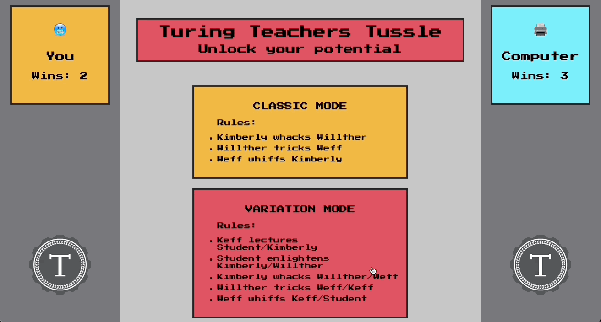

<h1 align="center">Rock-Paper-Scissors</h1>

Turing 2103 FE Mod 1 Final Solo Project
## Table of Contents
* [Introduction](#introduction)
* [Links](#Links)
* [Features](#Features)
* [Future Additions](#Future-Additions)
* [Contributors](#Contributors)
* [Languages](#Languages)

## Introduction
This project is a rock-paper-scissors game with 2 playable modes. One mode is the classic 3 way rock paper scissors and the other is a 5 way variation. Instead of the typical options of rock, paper, or scissors, I changed the options to different Turing instructors. To avoid accusations of bias in deciding which of my instructors would defeat other instructors, I decided to mix up each instructor's face with another. When the user selects their choice, the "computer" player selects another option randomly.

## Features
- Users can choose between two game modes: classic and variation
- Users can select between 3 "fighter" options in classic mode and 5 "fighter" options in variation mode.
- Each fighter has an equal chance of winning or losing to the computer.
- Both the user's and computer's wins are saved and displayed on the page. The total number of wins will persist on page load due to local storage

Users can choose between two game modes

Users can play classic mode

Users can play variation mode

User can change game mode after playing a round

### Future Additions
- Add ability to customize user name and associated emoji
- Add ability for a second person to play instead of the computer
- Add modes to increase the number of fighters to choose from
- Add a create your own fighter feature

## Contributors
[Taylor Galloway](https://github.com/tylrs) 
[Nick Nist](https://github.com/nicknist) (Code Review)

## Languages
JavaScript  
CSS  
HTML
